# MSTAR SAR Automatic Target Recognition — Comprehensive Project Report

**Handcrafted Features (HOG + LBP + Intensity → RBF‑SVM) vs. a CNN (ResNet18) vs. a Vision Transformer (DeiT‑Small) on the MSTAR SOC 10‑class benchmark.**

> Scope of this document: a single, end‑to‑end analysis of the whole repository — aim, background, dataset, exploratory data analysis (EDA), methodology (splitting, pre/post‑processing, reproducibility), the three experiments (architectures and hyperparameters), the evaluation protocol, full numerical results (headline + per‑class + confusion + training curves + efficiency), discussion, limitations, and a reproducibility guide. Every number is taken directly from the repository's result artifacts (`results/**/*.json`) and cross‑checked against the source code in `src/`. Image links point at the existing plots in `results/` so they render in place on GitHub.

---

## Table of Contents

1. [Executive Summary](#1-executive-summary)
2. [Aim & Objectives](#2-aim--objectives)
3. [Background](#3-background)
4. [Dataset](#4-dataset)
5. [Exploratory Data Analysis (EDA)](#5-exploratory-data-analysis-eda)
6. [Methodology — Shared Pipeline](#6-methodology--shared-pipeline)
7. [Experiment 1 — Handcrafted Features + RBF‑SVM](#7-experiment-1--handcrafted-features--rbf-svm)
8. [Experiment 2 — ResNet18 (CNN)](#8-experiment-2--resnet18-cnn)
9. [Experiment 3 — DeiT‑Small (Vision Transformer)](#9-experiment-3--deit-small-vision-transformer)
10. [Evaluation Protocol & Metrics](#10-evaluation-protocol--metrics)
11. [Results](#11-results)
12. [Discussion & Insights](#12-discussion--insights)
13. [Limitations & Threats to Validity](#13-limitations--threats-to-validity)
14. [Conclusion & Recommendations](#14-conclusion--recommendations)
15. [Reproducibility / How to Run](#15-reproducibility--how-to-run)
16. [Appendix](#16-appendix)

---

## 1. Executive Summary

This project benchmarks three eras of image‑classification methodology on the **MSTAR Standard Operating Condition (SOC)** SAR dataset — a 10‑class military‑vehicle recognition problem. The same data split, metrics, plots and report format are produced for each method, so the comparison is apples‑to‑apples.

The central result is monotonic and clear: **learned representations dominate handcrafted descriptors, and a fine‑tuned Vision Transformer edges out the CNN.**

| Model | Accuracy | Macro‑F1 |
|---|---|---|
| Handcrafted + RBF‑SVM | **85.98 %** | 84.64 % |
| ResNet18 (CNN) | **92.49 %** | 91.52 % |
| DeiT‑Small (ViT) | **95.79 %** | 95.03 % |

- Moving from handcrafted features to the CNN adds **+6.5 accuracy points**; the ViT adds a further **+3.3 points** over the CNN (**+9.8** over the SVM).
- The gains concentrate exactly where the SVM is weakest — the visually similar armoured vehicles **BMP2 / BTR60 / BTR70 / T72**.
- Accuracy costs compute: the ViT is the largest (≈21.7 M params) and slowest learned model (10.2 ms/img); the CNN is the best accuracy/efficiency compromise (6.4 ms/img); the SVM is cheap to fit but inference is bottlenecked by handcrafted‑feature extraction (50 ms/img).

The full write‑up, all numerical tables, and the figures backing each claim follow below. (A condensed, auto‑generated version of this comparison lives at [`results/comparison/REPORT.md`](../results/comparison/REPORT.md); the present document is the expanded, hand‑written analysis.)

---

## 2. Aim & Objectives

**Aim.** Build and rigorously compare a representative classifier from each of three modelling paradigms for **SAR Automatic Target Recognition (ATR)** on a common, standard benchmark, quantifying not just accuracy but the full accuracy‑vs‑compute trade‑off.

**Objectives.**

1. Characterise the MSTAR SOC dataset and its idiosyncrasies (speckle, low mean intensity, class balance, raw‑pixel separability) via EDA — **before** any modelling.
2. Establish a strong classical baseline using hand‑engineered descriptors (intensity histogram + HOG + LBP) and an RBF‑SVM.
3. Fine‑tune an ImageNet‑pretrained **CNN (ResNet18)** to the SAR domain.
4. Fine‑tune an ImageNet‑pretrained **Vision Transformer (DeiT‑Small)** to the SAR domain.
5. Evaluate all three with an identical protocol — accuracy, macro precision/recall/F1, per‑class metrics, confusion matrices, ROC, inference latency, model size, parameter count — and explain *where* and *why* the methods differ (t‑SNE feature spaces, Grad‑CAM saliency, confusion analysis).

---

## 3. Background

**SAR and why it is hard.** Synthetic Aperture Radar produces images by coherently combining radar returns. Unlike optical photographs, SAR images contain **speckle** — a multiplicative, grainy interference pattern — and encode target geometry as bright scattering centres rather than familiar visual texture. The same vehicle looks markedly different across aspect (azimuth) and depression angles, and superficially similar vehicles (e.g., wheeled APCs) can have near‑identical low‑level signatures. This makes **ATR** — recognising the target class from its SAR signature — a genuinely difficult fine‑grained problem and a long‑standing benchmark task.

**MSTAR SOC.** The Moving and Stationary Target Acquisition and Recognition (MSTAR) program released X‑band SAR chips of ten military vehicles. The community‑standard **Standard Operating Condition (SOC)** protocol trains on chips collected at a **17° depression angle** and tests on a different **15° depression angle**, so the test set probes genuine generalisation across an imaging‑geometry shift rather than a random i.i.d. split.

---

## 4. Dataset

**Source layout.** Images are stored as single‑channel `.jpg` chips under a class‑per‑folder structure (`src/dataset.py:8‑9`):

```
data/mstar_raw/soc/{train,test}/<CLASS>/*.jpg
```

**Classes (ordered, index 0–9).** Defined once in `src/dataset.py:36‑38` and reused everywhere:

```
2S1, BMP2, BRDM2, BTR60, BTR70, D7, T62, T72, ZIL131, ZSU234
```

These span self‑propelled artillery (2S1, ZSU‑23‑4), infantry fighting / armoured personnel carriers (BMP2, BRDM2, BTR60, BTR70), tanks (T62, T72), a bulldozer (D7) and a truck (ZIL131).

**Split sizes (from `results/eda/dataset_stats.json`).** The train folder (17°) holds **2 747** chips; the test folder (15°) holds **2 425** chips. The training folder is further split 85/15 into train/validation (see §6).

| | Train folder (17°) | Used for training | Validation | Test folder (15°) |
|---|---:|---:|---:|---:|
| Count | 2 747 | 2 334 | 413 | 2 425 |

**Per‑class counts (from `dataset_stats.json`).**

| Class | Train (17°) | Test (15°) |
|---|---:|---:|
| 2S1 | 299 | 274 |
| BMP2 | 233 | 195 |
| BRDM2 | 298 | 274 |
| BTR60 | 256 | 195 |
| BTR70 | 233 | 196 |
| D7 | 299 | 274 |
| T62 | 299 | 273 |
| T72 | 232 | 196 |
| ZIL131 | 299 | 274 |
| ZSU234 | 299 | 274 |
| **Total** | **2 747** | **2 425** |

The classes are **mildly imbalanced** (232–299 per class in train), not enough to require resampling but enough to justify reporting **macro** metrics alongside accuracy.

**Image / pixel properties (from `dataset_stats.json`).** Images are **128 × 128**, grayscale, with pixel range `[0, 255]`. Computed normalisation statistics (on `[0,1]`‑scaled pixels) are **mean = 0.0295**, **std = 0.0346** — i.e., the chips are overwhelmingly dark, with the target occupying a small, bright fraction of the frame. These statistics are persisted and consumed by the deep models for input normalisation.

> **Caveat.** The chips here are 8‑bit JPEGs. Native MSTAR data is complex‑valued (magnitude + phase) and higher dynamic range; lossy JPEG storage discards phase and quantises magnitude. Results are therefore representative of *this* preprocessed corpus, not the raw complex SAR.

---

## 5. Exploratory Data Analysis (EDA)

EDA is performed first, in [`notebooks/01_eda.ipynb`](../notebooks/01_eda.ipynb) using helpers in `src/eda_viz.py`, and writes all artifacts to `results/eda/`. It both characterises the data and **produces the normalisation statistics the deep models depend on**.

### 5.1 Class distribution

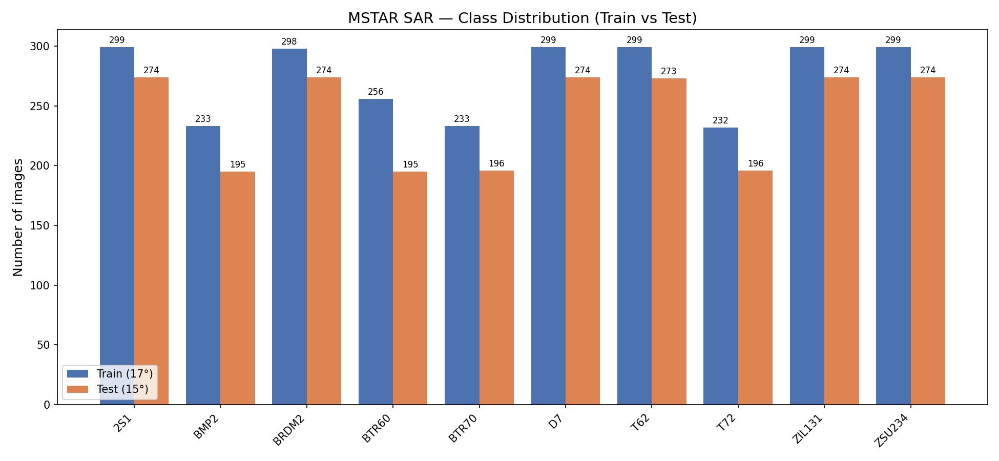

`plot_class_distribution()` draws train (17°) vs test (15°) counts side‑by‑side. The distribution is similar across splits and only mildly imbalanced — confirming macro‑averaged metrics are the right headline.

### 5.2 Sample imagery

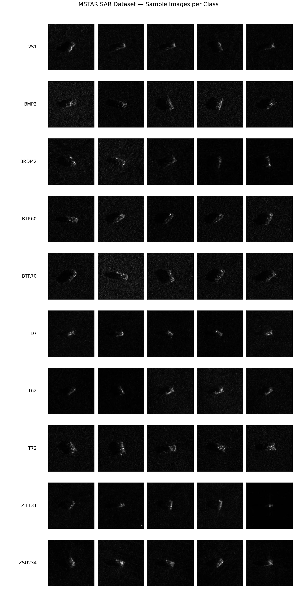

A 10 × 5 grid (5 random chips per class, seeded RNG) shows the visual character of SAR chips: a bright target blob on a dark, speckled background, with strong aspect‑angle variation within a class.

### 5.3 Per‑class mean images ("average signatures")

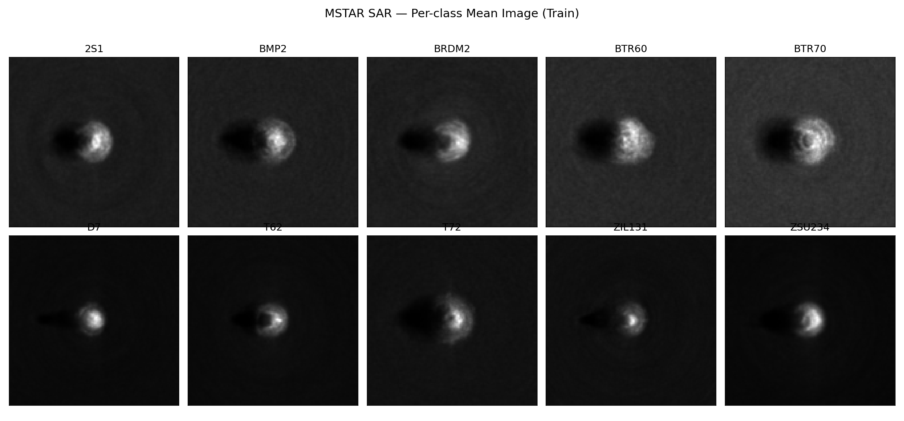

`plot_mean_images()` averages every chip in a class. The averages reveal class‑level shape/scale priors (e.g., the long‑barrelled tanks vs. the compact APCs), while the blur shows how much aspect variation each class contains.

### 5.4 Pixel‑intensity distributions (speckle)

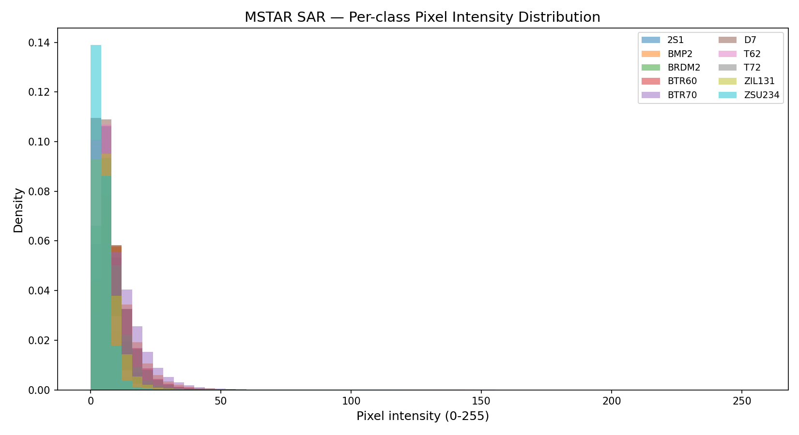

`plot_pixel_intensity()` overlays per‑class 64‑bin intensity histograms. All classes share a heavy dark‑pixel mass (hence the ~0.03 normalised mean) with class‑dependent bright tails — a direct visual motivation for the intensity‑histogram feature used by the classical baseline.

### 5.5 Raw‑pixel separability (t‑SNE)

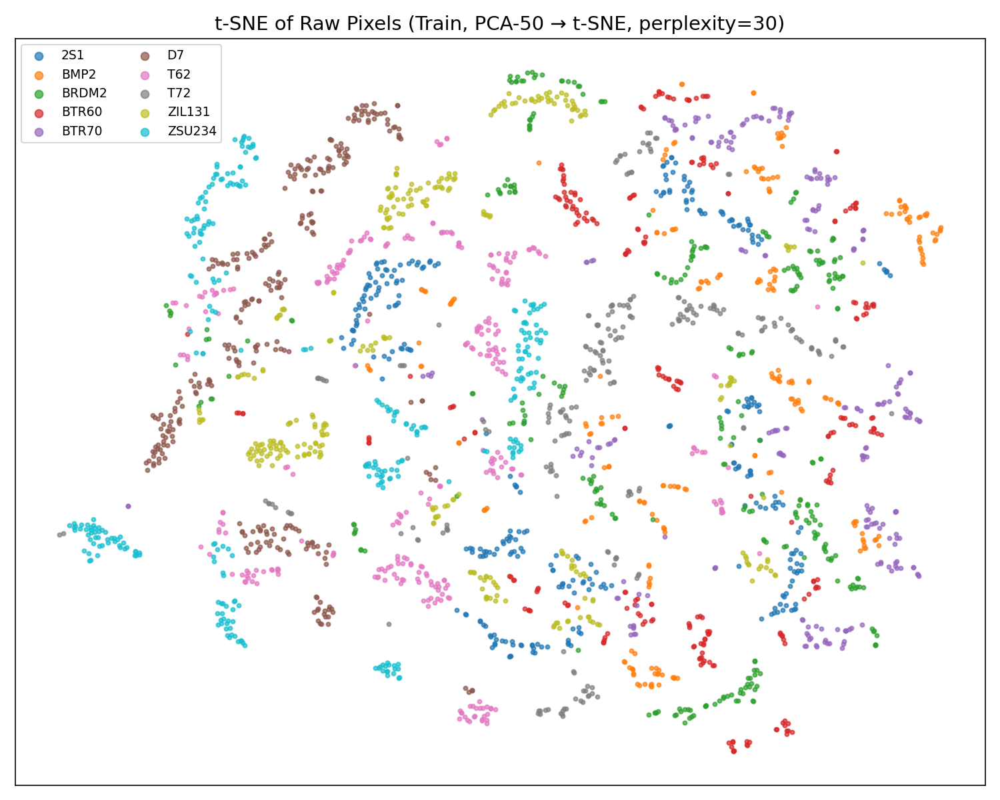

`plot_tsne_raw()` flattens each chip to a 16 384‑d vector, scales by 1/255, reduces to 50 dims with PCA, then runs **t‑SNE** (perplexity 30, `init="pca"`, seed 42). In **raw‑pixel space the classes overlap heavily**, with no clean clusters — this is the key empirical argument for learned representations, and the §11.6 t‑SNE comparison shows how dramatically the CNN and ViT tighten these clusters. The 2‑D embedding is cached to `results/eda/tsne_raw_train.npy` for reuse in the final comparison.

### 5.6 Normalisation statistics (the EDA → modelling handoff)

The final EDA cell computes pixel mean/std and per‑class counts and writes `results/eda/dataset_stats.json`. **Notebooks 03 (CNN) and 04 (ViT) read this file** to normalise inputs — making EDA a hard dependency of the deep‑learning experiments, not just a descriptive step.

---

## 6. Methodology — Shared Pipeline

### 6.1 Repository architecture

The project deliberately separates a reusable library from per‑experiment drivers:

- **`src/`** — shared code: `dataset.py` (loading, splitting, transforms), `features.py` (handcrafted descriptors), `traditional.py` (SVM pipeline), `cnn.py` (ResNet18 + training loop), `vit.py` (DeiT‑Small), `evaluate.py` (metrics, latency, plotting utilities), `eda_viz.py`, `visualize.py` (t‑SNE, Grad‑CAM), `comparison.py` (cross‑model aggregation + report generation).
- **`notebooks/`** — one self‑contained notebook per experiment, run **in order** `01 → 05`.
- **`results/<experiment>/`** — each experiment writes its own plots + a metrics `.json` + a test‑outputs `.npz`.
- **`models/`** — saved weights (`resnet18_best.pth`, `deit_small_best.pth`, `traditional_pipeline.joblib`).

### 6.2 Data splitting

- The **test set is fixed**: the entire 15°‑depression folder (2 425 chips), never seen during training/validation.
- The **training folder** (2 747 chips) is split into train/validation by `stratified_split()` (`src/dataset.py:148`) with `VAL_FRAC = 0.15` and `SEED = 42`, **stratified by class** via scikit‑learn's `train_test_split`. Result: **2 334 train / 413 validation**.
- Stratification preserves the class proportions in both train and validation; the fixed seed makes the split reproducible.

### 6.3 Pre‑processing & augmentation

Built by `build_transforms(size, train, mean, std)` (`src/dataset.py:79`). The pipeline, in order:

1. **Load** with PIL and force grayscale: `Image.open(path).convert("L")`.
2. **Resize** to the model's native input — **128 × 128** for ResNet18, **224 × 224** for DeiT.
3. **Train‑time augmentation only**: `RandomHorizontalFlip()`, `RandomVerticalFlip()`, `RandomRotation(15)` (±15°). Flips and small rotations are sensible for top‑down‑ish SAR chips where target azimuth is arbitrary. Validation/test use **no** augmentation (resize + normalise only).
4. **`ToTensor()`** → float in `[0, 1]`, shape `(1, H, W)`.
5. **`Normalize(mean, std)`** using the scalar EDA stats (fallback 0.5/0.5 if `dataset_stats.json` is missing).
6. **`RepeatTo3Channels()`** — replicate the single channel three times so the ImageNet‑pretrained, 3‑channel backbones accept the input unchanged.

**Loaders** (`make_loaders`): batch **64** (CNN) / **32** (ViT), `num_workers = 0` (avoids Windows multiprocessing hangs on this small dataset), `pin_memory = True`, train loader `shuffle=True` with a seeded generator; val/test `shuffle=False`.

### 6.4 Reproducibility & environment

- `seed_everything(42)` (`src/evaluate.py:18`) seeds Python `random`, NumPy, and Torch (CPU + all CUDA devices).
- Deep models use **AMP** (automatic mixed precision) for speed.
- Per the `README.md`: GPU training is **not** bit‑reproducible, so headline numbers may move by ~1 % between runs; the environment pins **`numpy < 2`** (the installed OpenCV/Torch builds are compiled against NumPy 1.x).

---

## 7. Experiment 1 — Handcrafted Features + RBF‑SVM

**Code:** `src/features.py`, `src/traditional.py`; **driver:** [`notebooks/02_traditional.ipynb`](../notebooks/02_traditional.ipynb).

### 7.1 Feature vector (8 190‑d)

Each chip is loaded grayscale at **128 × 128** (`load_gray_128`) and turned into a fixed‑length descriptor by `extract_features()`:

| Component | Parameters | Dimensions |
|---|---|---:|
| Intensity histogram | 64 bins over `[0, 255]`, density‑normalised | **64** |
| **HOG** | 9 orientations, 8×8 px/cell, 2×2 cells/block, `L2‑Hys` norm | **8 100** |
| Uniform **LBP** | P = 24 neighbours, R = 3, `method="uniform"`, 26‑bin density histogram | **26** |
| **Total** | concatenated, `float32` | **8 190** |

(The 8 100‑d HOG dominates: a 128‑px image → 16×16 cells → 15×15 blocks × (9 orientations × 2×2 cells) = 8 100.) The descriptors mix **global intensity** (histogram), **local edge/gradient structure** (HOG), and **micro‑texture** (LBP).

### 7.2 Classifier

`build_pipeline()` (`src/traditional.py:8`) is a scikit‑learn `Pipeline`:

```python
StandardScaler()  →  SVC(kernel="rbf", C=10, gamma="scale",
                         decision_function_shape="ovr", random_state=42)
```

- **StandardScaler** zero‑means/unit‑variances the 8 190 features.
- **RBF‑SVM** with `C=10`, `gamma="scale"`, **one‑vs‑rest** decision scores (used later for ROC).
- The fitted pipeline is saved to `models/traditional_pipeline.joblib`.

### 7.3 Timing & model size (from `traditional_metrics.json`)

| Quantity | Value |
|---|---:|
| Feature extraction (train) | 49.54 s (18.03 ms/img) |
| Feature extraction (test) | 21.17 ms/img |
| SVM fit | 46.64 s |
| SVM predict (test) | 69.99 s |
| **Train time (total)** | **96.18 s** |
| **Inference** | **50.03 ms/img** |
| **Model size** | **172.22 MB** |
| Support vectors | **2 747** (= every training point) |

> **Notable:** the SVM retains **all 2 747 training points as support vectors**. On an 8 190‑d, mildly non‑separable problem the RBF margin is "full", which both inflates model size (172 MB) and signals that the handcrafted features do not afford a clean, low‑complexity boundary. Inference is dominated by **feature extraction**, not the SVM, which is why 50 ms/img is far slower than the deep models despite the simpler classifier.

---

## 8. Experiment 2 — ResNet18 (CNN)

**Code:** `src/cnn.py`; **driver:** [`notebooks/03_cnn.ipynb`](../notebooks/03_cnn.ipynb).

### 8.1 Architecture

- **Backbone:** `torchvision.models.resnet18(weights=ResNet18_Weights.DEFAULT)` — ImageNet‑pretrained.
- **Head:** the final FC is replaced with `nn.Linear(512, 10)` for the 10 MSTAR classes.
- **Input:** 128 × 128, 3‑channel (grayscale replicated; see §6.3).
- **Features for t‑SNE:** the 512‑d global‑average‑pool output (`extract_resnet_features`).

### 8.2 Two‑phase fine‑tuning

| | Phase 1 (head warm‑up) | Phase 2 (partial fine‑tune) |
|---|---|---|
| Trainable | `fc` only | `layer3` + `layer4` + `fc` |
| Epochs | 10 | 15 |
| LR | 1e‑3 | 1e‑4 |
| Scheduler | none | `CosineAnnealingLR` |
| Optimiser | AdamW, weight decay 1e‑4 | AdamW, weight decay 1e‑4 |
| Loss | Cross‑entropy | Cross‑entropy |

- **Early stopping** patience = 7; the **best‑validation** checkpoint is saved to `models/resnet18_best.pth`.
- **Phase boundary** recorded at epoch 10 (marked on the training‑curve plots).
- Parameters: **11 181 642 total**, **10 498 570 trainable** (Phase 2 frees the two deepest residual stages, which hold most of the weights — this is why "trainable" is ~94 % of the model even though Phase 1 trained only the head).

The rationale: a frozen ImageNet backbone already provides useful mid‑level edge/texture filters; unfreezing only the deepest blocks lets the network re‑specialise its high‑level features to SAR without destabilising the low‑level ones or overfitting the small dataset.

---

## 9. Experiment 3 — DeiT‑Small (Vision Transformer)

**Code:** `src/vit.py`; **driver:** [`notebooks/04_vit.ipynb`](../notebooks/04_vit.ipynb).

### 9.1 Architecture

- **Backbone:** `timm.create_model("deit_small_patch16_224", pretrained=True, num_classes=10)` — ImageNet‑pretrained DeiT‑Small.
- **Input:** 224 × 224, 3‑channel; tokenised into 196 patch tokens (14×14 grid) + 1 CLS token.
- **Head:** timm replaces the classifier head for 10 classes automatically.
- **Features for t‑SNE:** the 384‑d pre‑logits CLS representation (`forward_features` → `forward_head(..., pre_logits=True)`).

### 9.2 Two‑phase fine‑tuning (full‑network Phase 2)

| | Phase 1 (head warm‑up) | Phase 2 (**full** fine‑tune) |
|---|---|---|
| Trainable | `head` only | **entire network** |
| Epochs | 10 | 15 |
| LR | 1e‑3 | **5e‑5** |
| Scheduler | none | `CosineAnnealingLR` |
| Optimiser | AdamW, weight decay 1e‑4 | AdamW, weight decay 1e‑4 |
| Batch | 32 (OOM fallback → 16 → 8) | 32 |

- **Best‑validation** checkpoint saved to `models/deit_small_best.pth`.
- Parameters: **21 669 514 total, all trainable** in Phase 2.

> **Key design choice (documented in `src/vit.py`):** unlike the CNN, the ViT's Phase 2 **unfreezes the whole backbone** at a **lower LR (5e‑5)**. ViTs are more data‑hungry and transfer poorly with a frozen backbone on an out‑of‑domain target like SAR; the "last‑two‑blocks" recipe that suffices for ResNet18 would leave the transformer stuck on ImageNet‑centric low‑level features. Full fine‑tuning at a small LR lets DeiT adapt while preserving pretrained knowledge — and it is also why ViT training takes ~2.6× longer than the CNN.

---

## 10. Evaluation Protocol & Metrics

All models are scored identically by `compute_metrics()` (`src/evaluate.py:27`) on the held‑out 2 425‑image test set:

- **Accuracy**, **macro precision/recall/F1**, **per‑class precision/recall/F1**, full sklearn classification report, and the **10×10 confusion matrix**.
- **Latency** (`measure_latency_ms`): batch size 1, up to 500 images, 10 warm‑up iterations, CUDA‑synchronised, reported as ms/image.
- **Model size:** on‑disk file size in MB. **Parameter counts:** total and trainable (`count_params`).
- **Outputs persisted** per experiment: `*_metrics.json` (all numbers above) and `*_test_outputs.npz` (`y_true`, `y_pred`, probabilities/scores, and extracted features for t‑SNE). Confusion matrices and training curves are saved as PNGs.

The cross‑model stage ([`notebooks/05_comparison.ipynb`](../notebooks/05_comparison.ipynb), `src/comparison.py`, `src/visualize.py`) aggregates the three result sets into the comparison plots, `final_comparison.json`, and the auto‑generated `REPORT.md`. The "Key Findings" text in that auto‑report is **templated** — the worst‑class triple and the accuracy deltas are computed from the data at generation time, not hand‑written.

---

## 11. Results

### 11.1 Master comparison

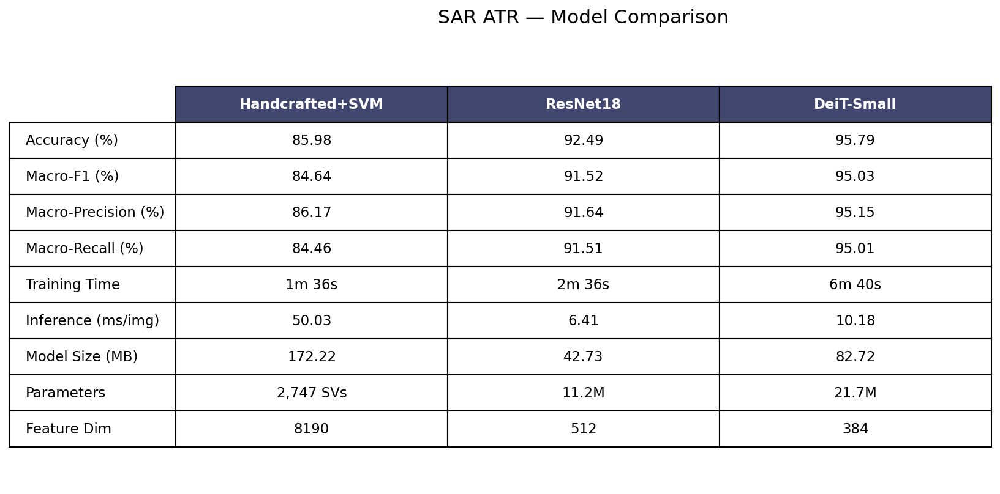

| Metric | Handcrafted + SVM | ResNet18 | DeiT‑Small |
|---|---:|---:|---:|
| Accuracy | 85.98 % | 92.49 % | **95.79 %** |
| Macro‑F1 | 84.64 % | 91.52 % | **95.03 %** |
| Macro‑Precision | 86.17 % | 91.64 % | **95.15 %** |
| Macro‑Recall | 84.46 % | 91.51 % | **95.01 %** |
| Weighted‑F1 | 86.10 % | 92.53 % | **95.79 %** |
| Training time | 96.2 s | 156.1 s | 400.8 s |
| Inference (ms/img) | 50.03 | **6.41** | 10.18 |
| Model size (MB) | 172.22 | **42.73** | 82.72 |
| Parameters | 2 747 SVs | 11.18 M (10.50 M trainable) | 21.67 M (all trainable) |
| Feature dim | 8 190 | 512 | 384 |

**Reading it:** accuracy rises monotonically SVM → CNN → ViT, and so does compute cost on the learned side. The CNN is both the **smallest** and **fastest** model overall while already beating the SVM by 6.5 points; the ViT buys the top accuracy at roughly double the parameters and 1.6× the CNN's latency.

### 11.2 Per‑class metrics (all three models)

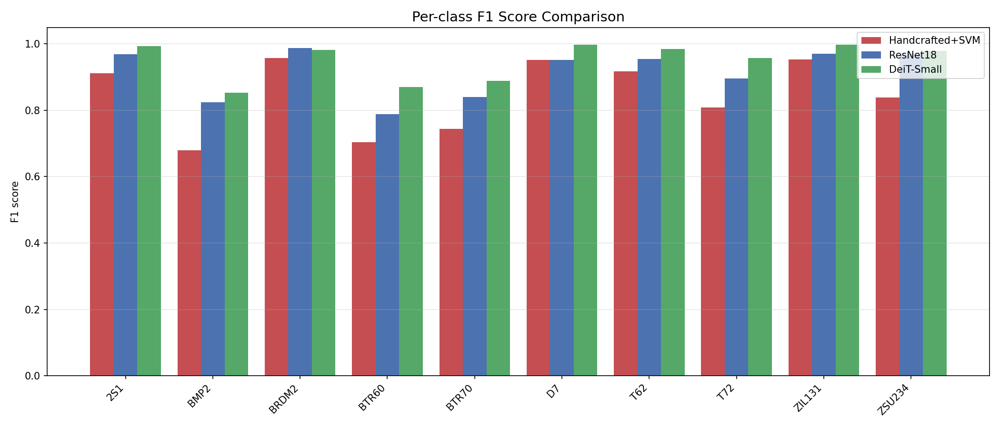

**Per‑class F1, ordered worst→best by the SVM** (this ordering exposes the hard cluster):

| Class | SVM F1 | CNN F1 | ViT F1 |
|---|---:|---:|---:|
| BMP2 | 0.680 | 0.824 | 0.853 |
| BTR60 | 0.704 | 0.788 | 0.870 |
| BTR70 | 0.744 | 0.840 | 0.889 |
| T72 | 0.808 | 0.896 | 0.957 |
| ZSU234 | 0.838 | 0.970 | 0.978 |
| 2S1 | 0.911 | 0.969 | 0.993 |
| T62 | 0.918 | 0.955 | 0.985 |
| ZIL131 | 0.953 | 0.971 | 0.998 |
| D7 | 0.951 | 0.952 | 0.998 |
| BRDM2 | 0.957 | 0.987 | 0.982 |

**Full per‑class precision / recall / F1:**

*Handcrafted + SVM*

| Class | Precision | Recall | F1 | Support |
|---|---:|---:|---:|---:|
| 2S1 | 0.925 | 0.898 | 0.911 | 274 |
| BMP2 | 0.776 | 0.605 | 0.680 | 195 |
| BRDM2 | 0.981 | 0.934 | 0.957 | 274 |
| BTR60 | 0.619 | 0.815 | 0.704 | 195 |
| BTR70 | 0.865 | 0.653 | 0.744 | 196 |
| D7 | 0.973 | 0.931 | 0.951 | 274 |
| T62 | 0.987 | 0.857 | 0.918 | 273 |
| T72 | 0.781 | 0.837 | 0.808 | 196 |
| ZIL131 | 0.984 | 0.923 | 0.953 | 274 |
| ZSU234 | 0.725 | 0.993 | 0.838 | 274 |
| **Macro** | **0.862** | **0.845** | **0.846** | 2 425 |

*ResNet18 (CNN)*

| Class | Precision | Recall | F1 | Support |
|---|---:|---:|---:|---:|
| 2S1 | 0.971 | 0.967 | 0.969 | 274 |
| BMP2 | 0.786 | 0.867 | 0.824 | 195 |
| BRDM2 | 0.993 | 0.982 | 0.987 | 274 |
| BTR60 | 0.767 | 0.810 | 0.788 | 195 |
| BTR70 | 0.882 | 0.801 | 0.840 | 196 |
| D7 | 0.959 | 0.945 | 0.952 | 274 |
| T62 | 0.973 | 0.938 | 0.955 | 273 |
| T72 | 0.915 | 0.878 | 0.896 | 196 |
| ZIL131 | 0.967 | 0.974 | 0.971 | 274 |
| ZSU234 | 0.951 | 0.989 | 0.970 | 274 |
| **Macro** | **0.916** | **0.915** | **0.915** | 2 425 |

*DeiT‑Small (ViT)*

| Class | Precision | Recall | F1 | Support |
|---|---:|---:|---:|---:|
| 2S1 | 0.996 | 0.989 | 0.993 | 274 |
| BMP2 | 0.830 | 0.877 | 0.853 | 195 |
| BRDM2 | 0.971 | 0.993 | 0.982 | 274 |
| BTR60 | 0.867 | 0.872 | 0.870 | 195 |
| BTR70 | 0.948 | 0.837 | 0.889 | 196 |
| D7 | 0.996 | 1.000 | 0.998 | 274 |
| T62 | 1.000 | 0.971 | 0.985 | 273 |
| T72 | 0.941 | 0.974 | 0.957 | 196 |
| ZIL131 | 1.000 | 0.996 | 0.998 | 274 |
| ZSU234 | 0.965 | 0.993 | 0.978 | 274 |
| **Macro** | **0.951** | **0.950** | **0.950** | 2 425 |

**Insights.** Every model agrees on the easy classes (BRDM2, D7, ZIL131, 2S1 — distinctive shapes/sizes). The disagreement is entirely on **BMP2 / BTR60 / BTR70 / T72** — small, similar armoured vehicles. The SVM collapses here (BMP2 F1 0.68, BTR60 0.70); the CNN repairs most of it (+0.10–0.14 F1); the ViT pushes BTR60 (0.79→0.87) and T72 (0.90→0.96) further still. Note the SVM's pathological **ZSU234** behaviour — recall 0.99 but precision only 0.73, i.e. it over‑predicts ZSU234 as a "dumping ground" for uncertain chips (visible as a hot column in its confusion matrix).

### 11.3 Confusion‑matrix analysis

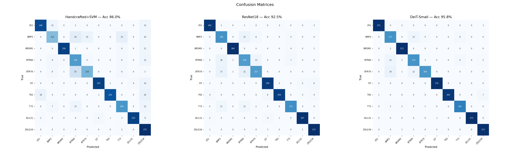

Individual matrices: [`cm_traditional.png`](../results/traditional/cm_traditional.png) · [`cm_cnn.png`](../results/cnn/cm_cnn.png) · [`cm_vit.png`](../results/vit/cm_vit.png).

**Top confusions (true → predicted), extracted from the saved confusion matrices:**

| Model | #1 | #2 | #3 | #4 |
|---|---|---|---|---|
| SVM | BTR70→BTR60 (53) | BMP2→BTR60 (29) | BMP2→T72 (23) | T62→ZSU234 (20) |
| CNN | BTR70→BTR60 (21) | BTR70→BMP2 (17) | BTR60→BMP2 (16) | BMP2→BTR60 (15) |
| ViT | BTR70→BMP2 (19) | BMP2→BTR60 (13) | BTR60→BMP2 (12) | BTR70→BTR60 (12) |

The errors are **almost entirely inside the {BMP2, BTR60, BTR70} APC/IFV cluster** for all three models — these vehicles have genuinely similar SAR signatures. The classical pipeline additionally suffers off‑cluster leakage into ZSU234 (and T62→ZSU234, T62→2S1), which the learned models eliminate. As capability grows, the off‑diagonal mass shrinks and concentrates: SAR's hard cases are fundamentally the lookalike armoured vehicles, and even DeiT does not fully solve them (BMP2 remains its weakest class at F1 0.853).

### 11.4 Training dynamics

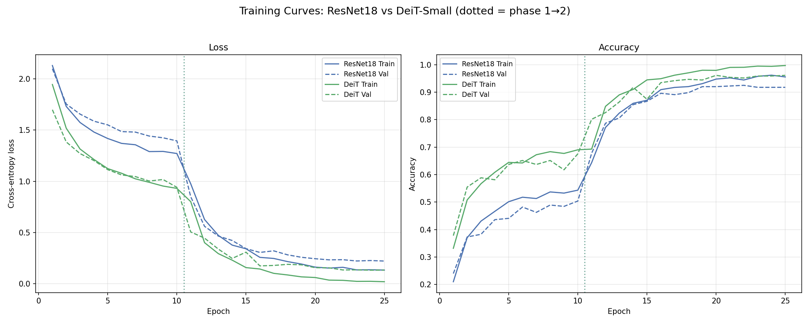

Per‑model curves: [`cnn_training_curves.png`](../results/cnn/cnn_training_curves.png) · [`vit_training_curves.png`](../results/vit/vit_training_curves.png). The vertical dashed line marks the Phase‑1→2 boundary (epoch 10).

**ResNet18 — full epoch‑by‑epoch (best val acc 0.9249 at Phase‑2 epoch 12):**

| Phase | Epoch | LR | Train loss | Val loss | Train acc | Val acc |
|---|---:|---:|---:|---:|---:|---:|
| 1 | 1 | 1.0e‑3 | 2.130 | 2.099 | 0.210 | 0.240 |
| 1 | 2 | 1.0e‑3 | 1.731 | 1.755 | 0.370 | 0.373 |
| 1 | 3 | 1.0e‑3 | 1.574 | 1.656 | 0.431 | 0.383 |
| 1 | 4 | 1.0e‑3 | 1.482 | 1.587 | 0.466 | 0.436 |
| 1 | 5 | 1.0e‑3 | 1.418 | 1.551 | 0.501 | 0.441 |
| 1 | 6 | 1.0e‑3 | 1.371 | 1.486 | 0.518 | 0.482 |
| 1 | 7 | 1.0e‑3 | 1.357 | 1.481 | 0.513 | 0.462 |
| 1 | 8 | 1.0e‑3 | 1.291 | 1.442 | 0.537 | 0.489 |
| 1 | 9 | 1.0e‑3 | 1.292 | 1.425 | 0.533 | 0.484 |
| 1 | 10 | 1.0e‑3 | 1.272 | 1.395 | 0.543 | 0.504 |
| 2 | 1 | 1.0e‑4 | 0.977 | 0.850 | 0.644 | 0.678 |
| 2 | 2 | 9.9e‑5 | 0.628 | 0.561 | 0.772 | 0.787 |
| 2 | 3 | 9.6e‑5 | 0.472 | 0.466 | 0.824 | 0.806 |
| 2 | 4 | 9.0e‑5 | 0.378 | 0.423 | 0.859 | 0.855 |
| 2 | 5 | 8.3e‑5 | 0.342 | 0.343 | 0.871 | 0.867 |
| 2 | 6 | 7.5e‑5 | 0.258 | 0.306 | 0.909 | 0.896 |
| 2 | 7 | 6.5e‑5 | 0.248 | 0.322 | 0.917 | 0.891 |
| 2 | 8 | 5.5e‑5 | 0.217 | 0.283 | 0.920 | 0.898 |
| 2 | 9 | 4.5e‑5 | 0.193 | 0.259 | 0.931 | 0.920 |
| 2 | 10 | 3.5e‑5 | 0.163 | 0.245 | 0.948 | 0.920 |
| 2 | 11 | 2.5e‑5 | 0.153 | 0.234 | 0.952 | 0.923 |
| 2 | 12 | 1.7e‑5 | 0.161 | 0.235 | 0.944 | **0.925** |
| 2 | 13 | 9.5e‑6 | 0.136 | 0.223 | 0.958 | 0.918 |
| 2 | 14 | 4.3e‑6 | 0.137 | 0.227 | 0.962 | 0.918 |
| 2 | 15 | 1.1e‑6 | 0.134 | 0.222 | 0.955 | 0.918 |

**DeiT‑Small — full epoch‑by‑epoch (best val acc 0.9613 at Phase‑2 epoch 10):**

| Phase | Epoch | LR | Train loss | Val loss | Train acc | Val acc |
|---|---:|---:|---:|---:|---:|---:|
| 1 | 1 | 1.0e‑3 | 1.945 | 1.699 | 0.332 | 0.378 |
| 1 | 2 | 1.0e‑3 | 1.519 | 1.385 | 0.508 | 0.554 |
| 1 | 3 | 1.0e‑3 | 1.315 | 1.271 | 0.567 | 0.588 |
| 1 | 4 | 1.0e‑3 | 1.214 | 1.203 | 0.608 | 0.581 |
| 1 | 5 | 1.0e‑3 | 1.124 | 1.114 | 0.644 | 0.637 |
| 1 | 6 | 1.0e‑3 | 1.079 | 1.063 | 0.642 | 0.651 |
| 1 | 7 | 1.0e‑3 | 1.025 | 1.047 | 0.672 | 0.637 |
| 1 | 8 | 1.0e‑3 | 0.991 | 1.003 | 0.683 | 0.651 |
| 1 | 9 | 1.0e‑3 | 0.954 | 1.018 | 0.677 | 0.617 |
| 1 | 10 | 1.0e‑3 | 0.931 | 0.942 | 0.690 | 0.676 |
| 2 | 1 | 5.0e‑5 | 0.802 | 0.506 | 0.693 | 0.801 |
| 2 | 2 | 4.9e‑5 | 0.402 | 0.446 | 0.848 | 0.826 |
| 2 | 3 | 4.8e‑5 | 0.294 | 0.339 | 0.890 | 0.864 |
| 2 | 4 | 4.5e‑5 | 0.231 | 0.248 | 0.910 | 0.918 |
| 2 | 5 | 4.2e‑5 | 0.158 | 0.309 | 0.945 | 0.874 |
| 2 | 6 | 3.8e‑5 | 0.144 | 0.175 | 0.949 | 0.935 |
| 2 | 7 | 3.3e‑5 | 0.102 | 0.179 | 0.962 | 0.942 |
| 2 | 8 | 2.8e‑5 | 0.086 | 0.190 | 0.970 | 0.947 |
| 2 | 9 | 2.2e‑5 | 0.068 | 0.185 | 0.980 | 0.944 |
| 2 | 10 | 1.7e‑5 | 0.061 | 0.157 | 0.979 | **0.961** |
| 2 | 11 | 1.3e‑5 | 0.036 | 0.156 | 0.990 | 0.954 |
| 2 | 12 | 8.3e‑6 | 0.034 | 0.135 | 0.991 | 0.952 |
| 2 | 13 | 4.8e‑6 | 0.024 | 0.136 | 0.995 | 0.959 |
| 2 | 14 | 2.2e‑6 | 0.024 | 0.133 | 0.994 | 0.959 |
| 2 | 15 | 5.5e‑7 | 0.020 | 0.134 | 0.997 | 0.961 |

**Insights.** Phase 1 (frozen backbone) plateaus low for both — ~50 % val for ResNet, ~68 % for DeiT — confirming that a frozen ImageNet backbone is not enough for SAR. The jump happens at the Phase‑2 boundary: unfreezing deeper layers (CNN) / the whole network (ViT) immediately lifts val accuracy by 15–20 points within one epoch, then cosine‑annealing refines it. DeiT clearly **overfits late** (train acc → 0.997 while val plateaus ~0.96), which is exactly why best‑val checkpointing matters — the deployed weights are epoch‑10, not the last epoch.

### 11.5 Efficiency & complexity

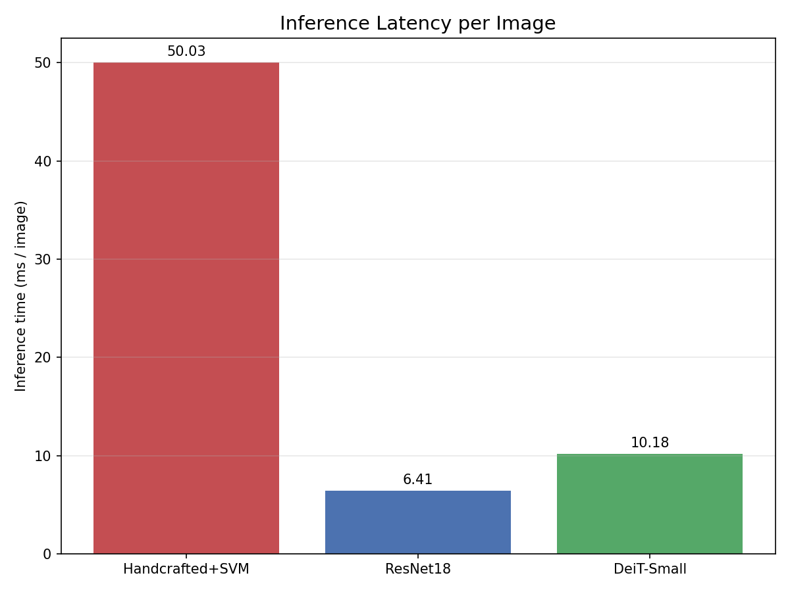
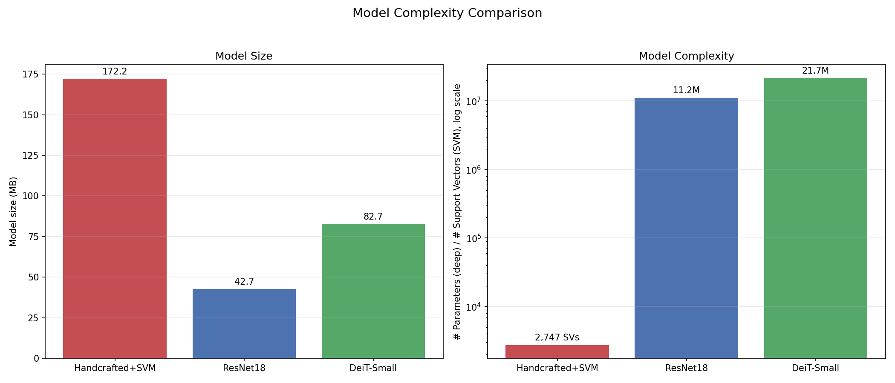

- **Latency:** CNN 6.41 ms/img < ViT 10.18 ms/img ≪ SVM 50.03 ms/img. The SVM is slow **not** because of the classifier but because each prediction first runs HOG+LBP+histogram extraction (~18–21 ms/img) and then scores against 2 747 support vectors.
- **Size:** SVM 172 MB (all‑points‑as‑SVs) ≫ ViT 82.7 MB > CNN 42.7 MB.
- **Params:** SVM 2 747 SVs; CNN 11.18 M; ViT 21.67 M. The complexity plot uses a log scale to place SVs and neural parameters on one axis.

The practical takeaway: the "classical" method is *not* the lightweight option at inference time here — the CNN is both more accurate **and** ~8× faster per image.

### 11.6 Feature space, ROC, and explainability

**Feature‑space t‑SNE** — raw pixels vs ResNet18 (512‑d) vs DeiT (384‑d):

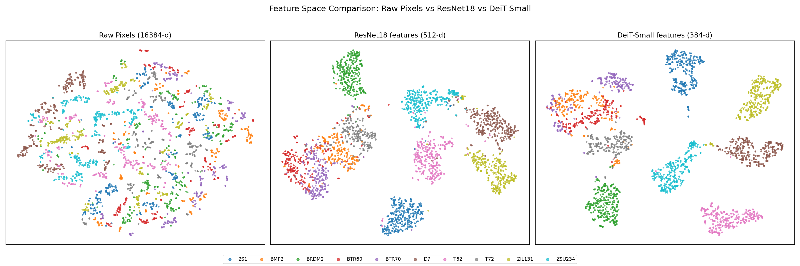

Raw pixels are an entangled blob (matching the EDA t‑SNE); ResNet features form mostly separated clusters; DeiT features are the tightest and best separated — a visual analogue of the accuracy ranking.

**ROC (one‑vs‑rest, with micro/macro averages):**

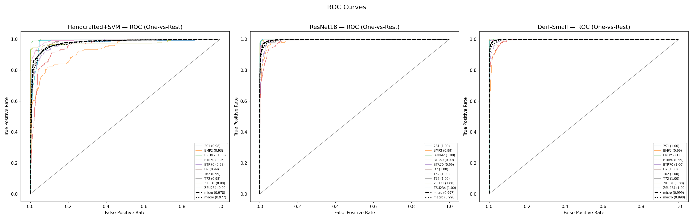

Per‑class and averaged AUCs improve in the same SVM → CNN → ViT order; the learned models approach the top‑left corner on nearly every class.

**Grad‑CAM saliency:**


`gradcam_grid()` overlays Grad‑CAM for the ResNet (`model.layer4[-1]`) and DeiT (`blocks[-1].norm1`, with the CLS token dropped and tokens reshaped to 14×14). The CNN tends to fire on **local edges/scattering contours** of the target; the ViT's attention is **more global**, spreading across the target's spatial extent — consistent with self‑attention capturing long‑range structure that helps disambiguate the lookalike vehicles.

**Misclassified examples:**

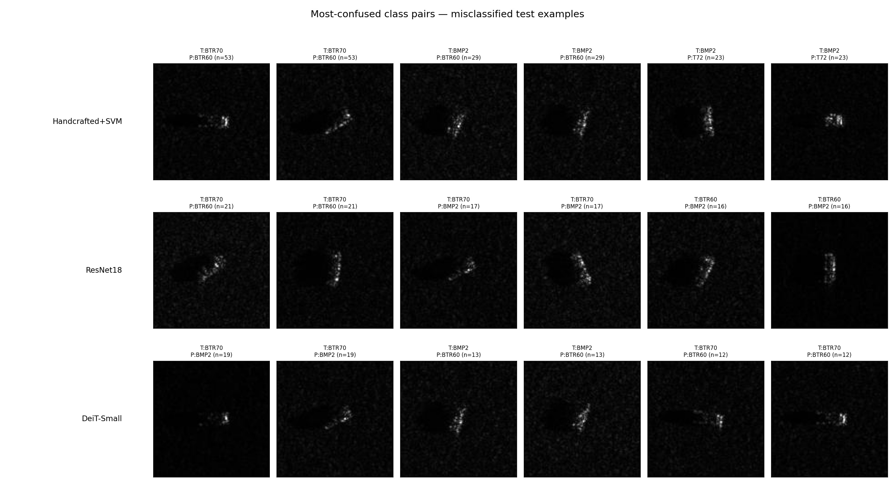

`plot_misclassified()` shows each model's top confusion pairs with real chips — visually confirming that the errors are between genuinely similar armoured vehicles, not random.

---

## 12. Discussion & Insights

1. **Where the handcrafted method breaks.** HOG/LBP/intensity encode fixed, local edge/texture statistics. They cannot separate vehicles whose SAR signatures differ only in subtle structure — hence the SVM's collapse on BMP2 (F1 0.68), BTR60 (0.70), BTR70 (0.74), and its ZSU234 over‑prediction. The fact that *every* training point becomes a support vector is itself a symptom: the feature space has no clean margin.

2. **What the CNN adds (+6.5 pts accuracy, +6.9 pts macro‑F1).** Learned hierarchical features are far more discriminative than fixed descriptors. ResNet18 lifts every hard class by 0.08–0.14 F1 and tightens the t‑SNE clusters. Crucially it does this while being the **smallest and fastest** model — the single best efficiency story in the study.

3. **The transformer's extra edge (+3.3 pts over the CNN).** DeiT's global self‑attention captures long‑range spatial relationships across the target, giving the largest gains precisely on the hardest, most structurally similar classes (BTR60 +0.08 F1, T72 +0.06, BTR70 +0.05 vs CNN). Reaching this required **full‑network** fine‑tuning at a small LR — a frozen or shallowly‑tuned ViT would not have adapted to the SAR domain.

4. **Accuracy costs compute.** The ranking on accuracy (ViT > CNN > SVM) is mirrored on learned‑model cost (ViT is 2× the params and 1.6× the latency of the CNN). There is no free lunch: the +3.3‑point ViT gain is bought with ~2.6× the training time and ~1.6× the inference latency.

5. **The residual hard problem is intrinsic.** All three models err inside the {BMP2, BTR60, BTR70} cluster, and even DeiT's worst class (BMP2, 0.853) sits there. This suggests the ceiling on this corpus is set by genuine inter‑class similarity (and JPEG quantisation), not by model capacity alone.

---

## 13. Limitations & Threats to Validity

- **All‑points‑as‑support‑vectors (SVM).** Indicates the handcrafted feature space is hard to separate cleanly; the 172 MB model would scale poorly to larger training sets.
- **Validation used for checkpoint selection.** Best‑val checkpointing is standard, but the reported test numbers are from the run whose checkpoint was chosen on val — there is no separate model‑selection holdout beyond train/val/test.
- **Single run, no error bars.** GPU training is non‑deterministic; the `README.md` notes ~±1 % run‑to‑run movement. The reported numbers are point estimates.
- **JPEG‑encoded SAR.** Phase information is discarded and magnitude is quantised vs native complex MSTAR; absolute numbers may differ on raw data.
- **SOC only.** This evaluates the Standard Operating Condition (small 17°→15° depression shift). It does **not** test Extended Operating Conditions (large depression changes, configuration/version variants, articulation, occlusion), which are the harder MSTAR generalisation regimes.
- **Augmentation assumptions.** Horizontal/vertical flips assume azimuth invariance; for some asymmetric vehicles this may not be strictly label‑preserving, though empirically it helps.

---

## 14. Conclusion & Recommendations

On MSTAR SOC, **learned representations clearly dominate handcrafted descriptors**, and a fully fine‑tuned **Vision Transformer (DeiT‑Small) gives the best accuracy (95.8 % / 95.0 % macro‑F1)**, edging out the CNN by 3.3 points by resolving more of the lookalike‑vehicle confusions through global attention.

Recommendation by deployment constraint:

- **Maximum accuracy, compute available →** DeiT‑Small (ViT).
- **Best accuracy/efficiency balance, edge/real‑time →** ResNet18 (CNN): 92.5 % accuracy at the smallest size (43 MB) and fastest latency (6.4 ms/img).
- **Handcrafted + SVM** remains a useful, interpretable baseline but is dominated here on both accuracy *and* inference speed; it is not the lightweight choice it might appear to be.

---

## 15. Reproducibility / How to Run

1. `pip install -r requirements.txt` (keep **`numpy < 2`**; use the Windows `py` launcher).
2. Run the notebooks **in order** — later ones depend on earlier outputs:
   1. [`01_eda.ipynb`](../notebooks/01_eda.ipynb) — EDA; writes `results/eda/dataset_stats.json` (normalisation stats).
   2. [`02_traditional.ipynb`](../notebooks/02_traditional.ipynb) — HOG+LBP+intensity → RBF‑SVM.
   3. [`03_cnn.ipynb`](../notebooks/03_cnn.ipynb) — ResNet18 two‑phase fine‑tuning (**needs the EDA stats**).
   4. [`04_vit.ipynb`](../notebooks/04_vit.ipynb) — DeiT‑Small two‑phase fine‑tuning (**needs the EDA stats**).
   5. [`05_comparison.ipynb`](../notebooks/05_comparison.ipynb) — cross‑model plots, Grad‑CAM, `final_comparison.json`, `REPORT.md` (**needs 02–04**).

Headless re‑run of any notebook:

```bash
py -m nbconvert --to notebook --execute --inplace \
   --ExecutePreprocessor.kernel_name=python3 notebooks/01_eda.ipynb
# repeat for 02–05 in order
```

**Dependency chain at a glance:** `01` → `dataset_stats.json` → `03`, `04`; `02`, `03`, `04` → `results/<exp>/*.json` + `*.npz` + `models/*` → `05` → comparison artifacts.

---

## 16. Appendix

### 16.1 Artifact index

**EDA — `results/eda/`**

| File | Description |
|---|---|
| `eda_class_distribution.png` | Train vs test per‑class counts |
| `eda_sample_images.png` | 10×5 grid of sample chips |
| `eda_mean_images.png` | Per‑class mean image |
| `eda_pixel_intensity.png` | Per‑class intensity histograms |
| `eda_tsne_raw.png` | Raw‑pixel t‑SNE (PCA‑50 → t‑SNE) |
| `tsne_raw_train.npy` | Cached 2‑D embedding + labels |
| `dataset_stats.json` | Sizes, per‑class counts, pixel mean/std |

**Per‑experiment — `results/{traditional,cnn,vit}/`**

| File | Description |
|---|---|
| `*_metrics.json` | Accuracy, macro/per‑class P/R/F1, confusion matrix, timing, size, params, (CNN/ViT) full training history |
| `*_test_outputs.npz` | `y_true`, `y_pred`, probabilities/scores, extracted features |
| `cm_*.png` | Per‑model confusion matrix |
| `cnn_training_curves.png`, `vit_training_curves.png` | Loss/accuracy vs epoch with phase boundary |

**Comparison — `results/comparison/`**

| File | Description |
|---|---|
| `comparison_table.png` | 9‑metric × 3‑model table |
| `confusion_matrices_comparison.png` | Three matrices side‑by‑side |
| `per_class_f1.png` | Grouped per‑class F1 bars |
| `training_curves_comparison.png` | CNN vs ViT loss/accuracy |
| `inference_time.png`, `model_complexity.png` | Latency / size / params |
| `roc_curves.png` | One‑vs‑rest ROC + micro/macro |
| `tsne_comparison.png` | Raw vs ResNet vs DeiT feature spaces |
| `gradcam_grid.png` | ResNet vs DeiT Grad‑CAM |
| `misclassified_examples.png` | Top confusion pairs with chips |
| `final_comparison.json` | Summary metrics for all three models |
| `REPORT.md` | Auto‑generated condensed report |

**Models — `models/`:** `resnet18_best.pth`, `deit_small_best.pth`, `traditional_pipeline.joblib`.

### 16.2 Glossary

- **SAR** — Synthetic Aperture Radar; coherent radar imaging producing speckled, geometry‑driven images.
- **ATR** — Automatic Target Recognition; classifying the target from its (SAR) signature.
- **MSTAR / SOC** — the X‑band SAR vehicle benchmark / its Standard Operating Condition protocol (train 17°, test 15° depression).
- **Depression angle** — the radar's look‑down angle; the train/test shift that makes SOC a generalisation test.
- **HOG** — Histogram of Oriented Gradients; local gradient‑orientation descriptor.
- **LBP** — Local Binary Pattern; micro‑texture descriptor (here `uniform`, P=24, R=3).
- **t‑SNE** — non‑linear 2‑D embedding for visualising high‑dimensional feature separability.
- **Grad‑CAM** — gradient‑based class‑activation mapping; highlights image regions driving a prediction.
- **Macro vs weighted average** — macro treats all classes equally (sensitive to small/hard classes); weighted averages by support.

---

*Generated from the repository's own result artifacts (`results/**`) and source modules (`src/**`). All metrics trace to `results/eda/dataset_stats.json`, `results/{traditional,cnn,vit}/*_metrics.json`, and `results/comparison/final_comparison.json`.*
